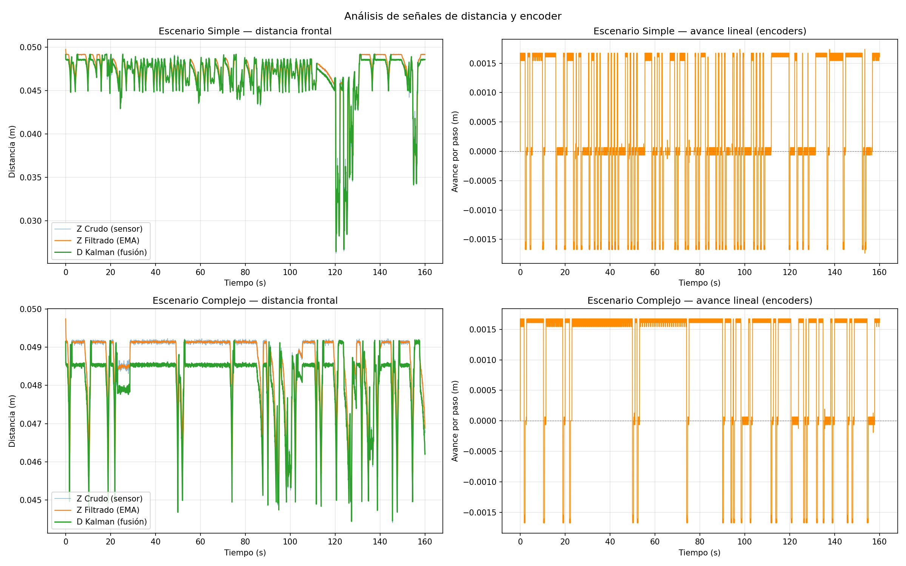
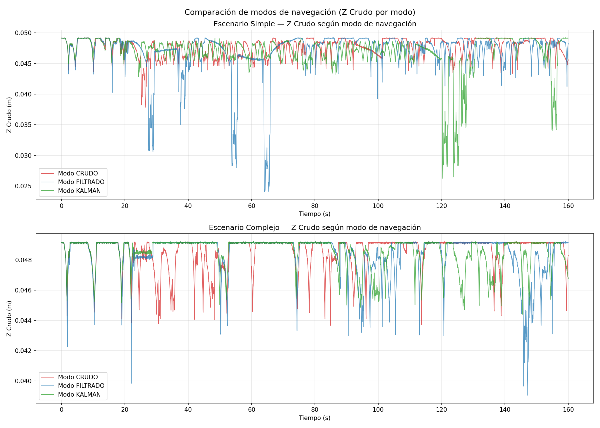

# Laboratorio 2 — Navegación reactiva con filtrado y fusión de sensores en Webots

**Curso:** Robótica y Sistemas Autónomos  
**Integrantes:** Martina Sandoval, Felipe Astudillo, Julian Guerrero

---

## 1. Objetivo

Implementar un sistema básico de navegación reactiva para un robot móvil diferencial (e-puck) en Webots, utilizando sensores de distancia y encoders de rueda, aplicando filtrado simple (EMA) sobre las mediciones y un filtro de Kalman escalar para estimar la distancia frontal a obstáculos mediante fusión sensorial. La estimación fusionada se usa para decidir si el robot avanza o gira, mejorando la robustez frente al ruido y la incertidumbre del sensor.

---

## 2. Descripción del robot y sensores

Se utilizó el robot **e-puck** estándar de Webots, un robot móvil diferencial con dos ruedas motrices independientes.

### Sensores utilizados (6 sensores de proximidad infrarroja + 2 encoders)

| Sensor | ID Webots | Función | Ángulo aproximado |
|--------|-----------|---------|-------------------|
| Frontal derecho | `ps0` | Detección de obstáculos al frente | +17° del frente |
| Frontal izquierdo | `ps7` | Detección de obstáculos al frente | −17° del frente |
| Diagonal derecho | `ps1` | Detección de obstáculos frontal-derecho | +37° |
| Diagonal izquierdo | `ps6` | Detección de obstáculos frontal-izquierdo | −37° |
| Lateral derecho | `ps5` | Decisión de dirección de giro | +90° |
| Lateral izquierdo | `ps2` | Decisión de dirección de giro | −90° |
| Encoder rueda derecha | `right wheel sensor` | Cálculo del avance lineal | — |
| Encoder rueda izquierda | `left wheel sensor` | Cálculo del avance lineal | — |

Los sensores `ps0–ps7` retornan valores entre 0 (sin obstáculo) y 4095 (obstáculo en contacto). La conversión a distancia utilizada es:

```
distancia = 0.05 × (1 − valor_sensor / 4095)
```

Esto entrega un rango lineal entre 0 m y 0.05 m (cobertura del sensor IR del e-puck).

---

## 3. Frecuencia de muestreo

- **Ts (tiempo de muestreo):** 32 ms
- **fs (frecuencia de muestreo):** 1 / 0.032 = **31.25 Hz**
- **Muestras por experimento:** 5000 (≈ 160 segundos de simulación por corrida)

Estos parámetros se reportan automáticamente al iniciar el controlador:
```
Controlador iniciado. Ts = 32 ms
Frecuencia de muestreo (fs) = 31.25 Hz
Modo de navegación activo: KALMAN
```

---

## 4. Estimación del avance mediante encoders

Los encoders entregan la posición angular acumulada de cada rueda en radianes. El avance lineal entre dos instantes consecutivos se calcula mediante la relación:

```
s = r × θ
```

donde `r = 0.0205 m` (radio de la rueda del e-puck). Promediando ambas ruedas:

```python
delta_theta_left  = enc_left  − prev_enc_left
delta_theta_right = enc_right − prev_enc_right
avance_lineal = WHEEL_RADIUS × (delta_theta_left + delta_theta_right) / 2
```

Este valor representa el desplazamiento neto del centro del robot en cada paso de simulación y se usa tanto como predicción del filtro de Kalman como para registrar la distancia recorrida. Se guarda en el CSV como columna `Avance_Lineal`.

---

## 5. Filtro simple aplicado (EMA)

Se aplicó un **Exponential Moving Average** sobre la medición Z (mínimo de los cuatro sensores frontales y diagonales) con factor `α = 0.3`:

```python
Z_filtrado(k) = α × Z_crudo(k) + (1 − α) × Z_filtrado(k−1)
```

Este filtro suaviza el ruido del sensor manteniendo una latencia razonable. Un α más alto = más reactivo pero más ruidoso; más bajo = más suave pero con mayor retardo.

---

## 6. Implementación del filtro de Kalman

Se implementó un **filtro de Kalman escalar** que estima la distancia frontal `d_k` al obstáculo más cercano, fusionando:

- **Predicción**: avance del robot medido por encoders
- **Corrección**: lectura del sensor frontal

### Parámetros

| Variable | Valor | Significado |
|----------|-------|-------------|
| `d_est` inicial | 0.05 | Distancia inicial asumida (rango máximo del sensor) |
| `P` inicial | 1.0 | Incertidumbre inicial alta (poca confianza inicial) |
| `Q` | 0.001 | Varianza del ruido del proceso (modelo de movimiento) |
| `R` | 0.0005 | Varianza del ruido de la medición (sensor frontal) |

El valor de Q se aumentó respecto a la inicialización típica para reflejar que el modelo de avance no es perfectamente confiable en espacio abierto (donde no hay un obstáculo real al cual acercarse). R se mantuvo bajo porque el sensor en simulación es razonablemente preciso.

### Etapas del filtro

**Predicción** (a partir del avance estimado por encoders):
```python
delta_d_k = −avance_lineal           # si avanza, distancia al obstáculo disminuye
d_pred = d_est + delta_d_k
P_pred = P + Q
```

**Corrección** (con la medición del sensor frontal):
```python
K_k   = P_pred / (P_pred + R)        # ganancia de Kalman
d_est = d_pred + K_k × (z_k − d_pred)
P     = (1 − K_k) × P_pred
```

Cuando `K_k` es alto (cerca de 1), el filtro confía más en la medición; cuando es bajo, confía más en la predicción.

---

## 7. Lógica de navegación reactiva

Se implementó una **máquina de estados** con tres estados:

| Estado | Acción |
|--------|--------|
| `ADVANCING` | Avanza recto a velocidad constante. Si detecta obstáculo → transición a `BACKING` |
| `BACKING` | Retrocede 15 pasos para alejarse del obstáculo |
| `TURNING` | Gira hasta que el frente esté despejado (mínimo 20 pasos, máximo 120 pasos) |

### Modo de navegación configurable

El controlador permite seleccionar qué señal se usa para tomar las decisiones de navegación mediante la variable `MODO_NAVEGACION`:

| Modo | Señal usada para decidir |
|------|--------------------------|
| `CRUDO` | Lectura directa del sensor (Z_crudo) |
| `FILTRADO` | Señal suavizada por EMA |
| `KALMAN` | Estimación fusionada del filtro de Kalman |

En todos los modos, las tres señales (crudo, filtrado, Kalman) se calculan y registran en el CSV para su posterior análisis.

### Detección de obstáculo

Se considera obstáculo cuando la señal del modo activo cae bajo `SAFE_DISTANCE = 0.045 m`. La medición Z se calcula como el mínimo de los cuatro sensores frontales y diagonales (`ps0`, `ps7`, `ps1`, `ps6`), lo que amplía el ángulo de visión y reduce colisiones en esquinas.

### Decisión de dirección de giro

Combinando los sensores laterales y diagonales para mayor robustez:

```python
peso_derecho   = v_r + v_dr     # ps5 + ps1
peso_izquierdo = v_l + v_dl     # ps2 + ps6
is_turning_left = (peso_derecho > peso_izquierdo)
```

Si hay más obstáculo a la derecha, gira a la izquierda, y viceversa.

### Detección de atascado y maniobra de escape

Se implementaron dos mecanismos anti-atasco:

1. **Por bucle**: si el robot ejecuta ≥ 4 giros en una ventana de 600 iteraciones, se considera atascado en un bucle.
2. **Por tiempo**: si el robot lleva más de 150 iteraciones sin poder avanzar libremente.

En cualquiera de los dos casos, ejecuta un **giro forzado de 90° (≈ 90 pasos)** en dirección opuesta a la última, sin permitir salida anticipada.

### Velocidades

| Acción | Velocidad |
|--------|-----------|
| Avanzar | 0.4 × MAX_SPEED (2.51 rad/s) |
| Retroceder | 0.4 × MAX_SPEED (negativo) |
| Girar | 0.6 × MAX_SPEED (ruedas opuestas) |

---

## 8. Gráficos de señales

### Figura 1 — Análisis de señales de distancia y encoder



- **Panel izquierdo (distancia frontal):** Las tres señales (Z_Crudo, Z_Filtrado, D_Kalman) se muestran en el mismo eje. En régimen estacionario se mantienen cerca de 0.0490 m (máximo del sensor). Las caídas corresponden a aproximaciones reales a obstáculos; los picos hacia arriba durante los retrocesos son capturados únicamente por el Kalman (refleja el movimiento del encoder).
- **Panel derecho (avance por encoder):** Muestra el desplazamiento lineal por paso de simulación. Los pulsos positivos son avances, los negativos son retrocesos. La señal es ruidosa pero centrada en cero durante los giros.

### Figura 2 — Comparación de modos de navegación



Muestra la señal Z_Crudo de cada una de las tres corridas (CRUDO, FILTRADO, KALMAN) superpuestas por escenario. Permite observar cómo cada modo de decisión produce trayectorias distintas.

---

## 9. Resultados obtenidos en los escenarios de prueba

### Estadísticas por escenario y modo

| Escenario | Modo | Muestras | Z_Crudo mín | Z_Crudo media | Std Z_Crudo | Std D_Kalman | Distancia avanzada (m) | Eventos obstáculo |
|-----------|------|----------|-------------|---------------|-------------|--------------|------------------------|-------------------|
| Simple | CRUDO | 5000 | 0.0379 | 0.0477 | 0.00147 | 0.00141 | 4.13 | 59 |
| Simple | FILTRADO | 5000 | 0.0241 | 0.0471 | 0.00349 | 0.00342 | 4.62 | 50 |
| Simple | KALMAN | 5000 | 0.0262 | 0.0469 | 0.00305 | 0.00298 | 3.53 | 30 |
| Complejo | CRUDO | 5000 | 0.0437 | 0.0486 | 0.00106 | 0.00092 | 6.37 | 28 |
| Complejo | FILTRADO | 5000 | 0.0390 | 0.0485 | 0.00132 | 0.00118 | 6.60 | 25 |
| Complejo | KALMAN | 5000 | 0.0444 | 0.0486 | 0.00097 | 0.00086 | 6.45 | 6 |

### Análisis cualitativo de comportamiento

**Escenario simple:**
- El modo **CRUDO** disparó 59 eventos de obstáculo (el más alto), muchos de ellos debido a ruido o falsas detecciones al borde del umbral.
- El modo **FILTRADO** redujo los eventos a 50 y aumentó la distancia recorrida a 4.62 m: el suavizado EMA evitó reaccionar ante picos transitorios, logrando más metros de avance efectivo.
- El modo **KALMAN** redujo drásticamente los eventos a 30, con mayor selectividad al incorporar la predicción del encoder. Sin embargo, recorrió menos distancia (3.53 m), debido a que el filtro en algunos momentos retrasó la reacción ante obstáculos reales, llevando al robot a zonas donde luego tardó más en salir.

**Escenario complejo:**
- El modo **CRUDO** registró 28 eventos, el modo **FILTRADO** 25, y el modo **KALMAN** apenas 6. Esta diferencia es llamativa ya que en el escenario complejo el Kalman fue extremadamente selectivo, casi ignorando los obstáculos en la primera aproximación y confiando más en la predicción de los encoders.
- Los tres modos recorrieron distancias similares (6.37–6.60 m), lo que indica que el robot exploró bien el escenario en todos los casos.
- La desviación estándar del escenario complejo es menor que la del simple (~0.001 vs ~0.003), lo que refleja que en el complejo el robot estuvo más tiempo en espacio abierto entre obstáculos.

### Comparación general

| Métrica | Simple | Complejo |
|---------|--------|----------|
| Estabilidad del movimiento | Media (muchos giros en CRUDO) | Alta (menos eventos, más avance continuo) |
| Giros innecesarios | Altos en CRUDO (59 eventos) | Reducidos; KALMAN casi no giró (6 eventos) |
| Capacidad de evitar colisiones | Buena en los 3 modos | Buena en los 3 modos |
| Diferencias señales crudas vs filtradas | Notables (std FILTRADO 2.4× mayor que CRUDO) | Moderadas |
| Diferencias filtradas vs Kalman | Pequeñas en señal; grandes en comportamiento | Muy grandes en comportamiento (KALMAN tuvo 76% menos eventos que FILTRADO: 6 vs 25) |

---

## 10. Análisis final y conclusiones

1. **El modo CRUDO es el más sensible al ruido**: en el escenario simple disparó 59 eventos frente a 30 del Kalman. Cada pequeña fluctuación del sensor cerca del umbral provocó una maniobra innecesaria, aumentando el número de giros y reduciendo la eficiencia de navegación.

2. **El filtro EMA mejora la navegación con un costo mínimo**: el modo FILTRADO es un punto intermedio sólido. Reduce eventos sin la latencia del Kalman, y en el escenario simple logró la mayor distancia recorrida (4.62 m). Es el modo más balanceado entre reactividad y estabilidad.

3. **El filtro de Kalman aporta información que ningún filtro de medición sola puede entregar**: al integrar la predicción basada en encoders, la estimación refleja no solo "qué tan lejos hay un obstáculo" sino también "cómo se está moviendo el robot respecto a él". Esto se traduce en los picos hacia arriba durante los retrocesos (visibles en `senales_distancia.png`) y en la dramática reducción de eventos en el escenario complejo (6 vs 28 del CRUDO).

4. **El ruido del sensor en simulación Webots es bajo**, por lo que el EMA y el Kalman entregan señales visualmente similares en régimen estacionario. En un robot real con ruido térmico/electromagnético, la diferencia entre modos sería aún más pronunciada.

5. **El comportamiento es replicable**: ambos escenarios usan el mismo controlador con los mismos parámetros, y los resultados son coherentes con la teoría (mayor filtrado → menos giros innecesarios → mayor eficiencia de navegación).

---

## 11. Instrucciones para ejecutar la simulación

### Requisitos
- **Webots R2025a** o superior
- **Python 3** con `matplotlib` instalado (`pip install matplotlib`)

### Estructura de carpetas
```
Lab_Robotica2/
├── worlds/
│   ├── escenario_facil.wbt               ← escenario simple
│   └── escenario_complejo.wbt            ← escenario complejo
├── controllers/
│   └── controlador_lab2/
│       ├── controlador_lab2.py           ← controlador principal
│       ├── graficar_datos.py             ← script de gráficos
│       ├── datos_sensores_simple_CRUDO.csv
│       ├── datos_sensores_simple_FILTRADO.csv
│       ├── datos_sensores_simple_KALMAN.csv
│       ├── datos_sensores_complejo_CRUDO.csv
│       ├── datos_sensores_complejo_FILTRADO.csv
│       ├── datos_sensores_complejo_KALMAN.csv
│       ├── senales_distancia.png
│       └── comparacion_modos.png
├── README.md
```

### Pasos para reproducir los datos

Para cada escenario (`simple` / `complejo`) y cada modo (`CRUDO`, `FILTRADO`, `KALMAN`), repetir:

1. Editar las líneas 4 y 7 de `controllers/controlador_lab2/controlador_lab2.py`:
   ```python
   SCENARIO_NAME = "simple"    # o "complejo"
   MODO_NAVEGACION = "CRUDO"   # o "FILTRADO" o "KALMAN"
   ```

2. Abrir Webots y cargar el mundo correspondiente:
   `File > Open World > Lab_Robotica2/worlds/escenario_facil.wbt`

3. Presionar **Play ▶**. El controlador corre 5000 iteraciones (160 s de simulación) y al terminar imprime:
   ```
   ¡Datos guardados exitosamente en datos_sensores_simple_CRUDO.csv! (5000 muestras)
   ```

4. Repetir para los demás modos y escenarios (6 corridas en total).

### Generar gráficos

Una vez obtenidos los 6 CSVs, ejecutar:
```bash
python3 controllers/controlador_lab2/graficar_datos.py
```
Genera dos imágenes en `controllers/controlador_lab2/`:
- `senales_distancia.png` — señales Z_Crudo, Z_Filtrado, D_Kalman y Avance_Lineal
- `comparacion_modos.png` — Z_Crudo comparado entre los 3 modos por escenario

### Parámetros configurables del controlador

Todos los parámetros principales están al inicio del archivo `controlador_lab2.py`:

```python
SCENARIO_NAME = "simple"         # o "complejo"
MODO_NAVEGACION = "KALMAN"       # "CRUDO", "FILTRADO" o "KALMAN"
MAX_ITERACIONES = 5000           # muestras a registrar (5000 = 160 s)
SAFE_DISTANCE = 0.045            # umbral para detectar obstáculo (m)
BACKUP_STEPS = 15                # pasos de retroceso
MIN_TURN_STEPS = 20              # giro mínimo por evento
MAX_TURN_STEPS = 120             # giro máximo (cap)
ESCAPE_TURN_STEPS = 90           # giro forzado al detectar atascado
STUCK_WINDOW = 600               # ventana para detectar bucle (iteraciones)
STUCK_THRESHOLD = 4              # giros máximos en la ventana
TIEMPO_MAXIMO_ATASCADO = 150     # iteraciones máx. sin avanzar antes de escape
```
