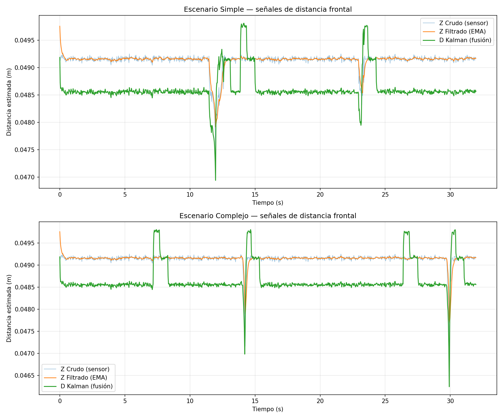

# Laboratorio 2 — Navegación reactiva con filtrado y fusión de sensores en Webots

**Curso:** Robótica y Sistemas Autónomos 
**Integrantes:** Martina Sandoval, Felipe Astudillo, Julian Guerrero

---

## 1. Objetivo

Implementar un sistema básico de navegación reactiva para un robot móvil diferencial (e-puck) en Webots, utilizando sensores de distancia y encoders de rueda, aplicando filtrado simple (EMA) sobre las mediciones y un filtro de Kalman escalar para estimar la distancia frontal a obstáculos mediante fusión sensorial. La estimación fusionada se usa para decidir si el robot avanza o gira, mejorando la robustez frente al ruido y la incertidumbre del sensor.

---

## 2. Descripción del robot y sensores

Se utilizó el robot **e-puck** estándar de Webots, un robot móvil diferencial con dos ruedas motrices independientes.

### Sensores utilizados (6 sensores de proximidad infrarroja + 2 encoders)

| Sensor | ID Webots | Función | Ángulo aproximado |
|--------|-----------|---------|-------------------|
| Frontal derecho | `ps0` | Detección de obstáculos al frente | +17° del frente |
| Frontal izquierdo | `ps7` | Detección de obstáculos al frente | −17° del frente |
| Diagonal derecho | `ps1` | Detección de obstáculos frontal-derecho | +37° |
| Diagonal izquierdo | `ps6` | Detección de obstáculos frontal-izquierdo | −37° |
| Lateral derecho | `ps5` | Decisión de dirección de giro | +90° |
| Lateral izquierdo | `ps2` | Decisión de dirección de giro | −90° |
| Encoder rueda derecha | `right wheel sensor` | Cálculo del avance lineal | — |
| Encoder rueda izquierda | `left wheel sensor` | Cálculo del avance lineal | — |

Los sensores `ps0–ps7` retornan valores entre 0 (sin obstáculo) y 4095 (obstáculo en contacto). La conversión a distancia utilizada es:

```
distancia = 0.05 × (1 − valor_sensor / 4095)
```

Esto entrega un rango lineal entre 0 m y 0.05 m (cobertura del sensor IR del e-puck).

---

## 3. Frecuencia de muestreo

- **Ts (tiempo de muestreo):** 32 ms 
- **fs (frecuencia de muestreo):** 1 / 0.032 = **31.25 Hz**
- **Muestras por experimento:** 1000 (≈ 32 segundos por escenario)

Estos parámetros se reportan automáticamente al iniciar el controlador:
```
Controlador iniciado. Ts = 32 ms
Frecuencia de muestreo (fs) = 31.25 Hz
```

---

## 4. Estimación del avance mediante encoders

Los encoders entregan la posición angular acumulada de cada rueda en radianes. El avance lineal entre dos instantes consecutivos se calcula mediante la relación:

```
s = r × θ
```

donde `r = 0.0205 m` (radio de la rueda del e-puck). Promediando ambas ruedas:

```python
delta_theta_left  = enc_left  − prev_enc_left
delta_theta_right = enc_right − prev_enc_right
avance_lineal = WHEEL_RADIUS × (delta_theta_left + delta_theta_right) / 2
```

Este valor representa el desplazamiento neto del centro del robot en cada paso de simulación.

---

## 5. Filtro simple aplicado (EMA)

Se aplicó un **Exponential Moving Average** sobre la medición Z (mínimo de los dos sensores frontales) con factor `α = 0.3`:

```python
Z_filtrado(k) = α × Z_crudo(k) + (1 − α) × Z_filtrado(k−1)
```

Este filtro suaviza el ruido del sensor manteniendo una latencia razonable. Un α más alto = más reactivo pero más ruidoso; más bajo = más suave pero con mayor retardo.

---

## 6. Implementación del filtro de Kalman

Se implementó un **filtro de Kalman escalar** que estima la distancia frontal `d_k` al obstáculo más cercano, fusionando:

- **Predicción**: avance del robot medido por encoders
- **Corrección**: lectura del sensor frontal

### Parámetros

| Variable | Valor | Significado |
|----------|-------|-------------|
| `d_est` inicial | 0.05 | Distancia inicial asumida (rango máximo del sensor) |
| `P` inicial | 1.0 | Incertidumbre inicial alta (poca confianza inicial) |
| `Q` | 0.001 | Varianza del ruido del proceso (modelo de movimiento) |
| `R` | 0.0005 | Varianza del ruido de la medición (sensor frontal) |

El valor de Q se aumentó respecto a la inicialización típica para reflejar que el modelo de avance no es perfectamente confiable en espacio abierto (donde no hay un obstáculo real al cual acercarse). R se mantuvo bajo porque el sensor en simulación es razonablemente preciso.

### Etapas del filtro

**Predicción** (a partir del avance estimado por encoders):
```python
delta_d_k = −avance_lineal           # si avanza, distancia al obstáculo disminuye
d_pred = d_est + delta_d_k
P_pred = P + Q
```

**Corrección** (con la medición del sensor frontal):
```python
K_k   = P_pred / (P_pred + R)        # ganancia de Kalman
d_est = d_pred + K_k × (z_k − d_pred)
P     = (1 − K_k) × P_pred
```

Cuando `K_k` es alto (cerca de 1), el filtro confía más en la medición; cuando es bajo, confía más en la predicción.

---

## 7. Lógica de navegación reactiva

Se implementó una **máquina de estados** con tres estados:

| Estado | Acción |
|--------|--------|
| `ADVANCING` | Avanza recto a velocidad constante. Si detecta obstáculo → transición a `BACKING` |
| `BACKING` | Retrocede 15 pasos para alejarse del obstáculo |
| `TURNING` | Gira hasta que el frente esté despejado (mínimo 20 pasos, máximo 120 pasos) |

### Detección de obstáculo
Se considera obstáculo detectado si:
1. La estimación del Kalman cae bajo `SAFE_DISTANCE = 0.045`, **O**
2. Cualquiera de los 4 sensores frontales (`ps0`, `ps7`, `ps1`, `ps6`) supera el umbral crudo de 200 (~4–5 cm físicos)

La doble condición cubre el ángulo muerto del e-puck (los sensores `ps0` y `ps7` apuntan a ±17°, no exactamente al frente, así que pueden no detectar obstáculos pequeños directamente al frente).

### Decisión de dirección de giro
Siguiendo la regla del enunciado del PDF (gira hacia el lado más despejado), se combinan los sensores laterales y diagonales para mayor robustez:

```python
peso_derecho   = v_r + v_dr     # ps5 + ps1
peso_izquierdo = v_l + v_dl     # ps2 + ps6
is_turning_left = (peso_derecho > peso_izquierdo)
```

Es decir: si hay más obstáculo a la derecha, gira a la izquierda, y viceversa.

### Detección de atascado y maniobra de escape
Si el robot ejecuta **más de 4 giros en una ventana de 150 iteraciones**, se considera atascado (típicamente en un callejón en V o diagonal). En ese caso ejecuta un **giro forzado de ~180°** (130 pasos) en dirección opuesta a la última, sin permitir salida anticipada.

### Velocidades

| Acción | Velocidad |
|--------|-----------|
| Avanzar | 0.4 × MAX_SPEED (2.5 rad/s en cada rueda) |
| Retroceder | 0.4 × MAX_SPEED (negativo) |
| Girar | 0.6 × MAX_SPEED (ruedas opuestas) |

---

## 8. Gráficos de señales



- Las tres señales se mantienen en régimen estacionario (~0.0485–0.0492 m) cuando el robot está en espacio abierto.
- Las caídas pronunciadas corresponden a la aproximación a un obstáculo (el sensor detecta algo cerca).
- Los picos hacia arriba (~0.0498 m) corresponden a la fase de retroceso de la maniobra de evasión: como `avance_lineal` se vuelve negativo, la predicción del Kalman aumenta.
- El escenario complejo muestra mayor cantidad de eventos que el simple, reflejando la densidad de obstáculos.


---

## 9. Resultados obtenidos en los escenarios de prueba

### Escenario simple (`worlds/Lab2.wbt`)
- Arena 2x2 m, 5 cajas de 10x10 cm dispersas
- Robot logra recorrer la arena, esquivar obstáculos y volver a zonas abiertas
- En 32 s de simulación se observan 2 eventos claros de detección + maniobra de evasión
- Sin colisiones registradas

### Escenario complejo (`worlds/escenario_complejo.wbt`)
- Arena 3x3 m con ~23 elementos: cajas pequeñas + paredes largas formando un entorno tipo laberinto
- Rellenar

### Análisis cualitativo de comportamiento

| Métrica | Simple | Complejo |
|---------|--------|----------|
| Estabilidad del movimiento | Alta (largos tramos de avance recto) | Media-alta (avance interrumpido por maniobras) |
| Cantidad de giros innecesarios | Pocos | Algunos (en zonas densas) |
| Capacidad de evitar colisiones | Excelente | Buena (depende de la geometría local) |
| Diferencias señales crudas vs filtradas | Mínimas (poco ruido en simulación) | Mínimas |
| Diferencias filtradas vs Kalman | Notables: el Kalman codifica los retrocesos | Más notables aún |

---

## 10. Análisis final y conclusiones

1. **El filtro de Kalman aporta información que ningún filtro de medición sola puede entregar**: al integrar la predicción basada en encoders, la señal estimada refleja no solo "qué tan lejos hay un obstáculo" sino también "cómo se está moviendo el robot respecto a él". Esto es visible en los picos hacia arriba durante las fases de retroceso.

2. **El ruido del sensor en simulación Webots es bajo**, por lo que el EMA y el Kalman entregan resultados visualmente similares en régimen estacionario. En un robot real con ruido térmico/electromagnético, ambos filtrados serían más decisivos.

3. **El comportamiento es replicable**: ambos escenarios usan el mismo controlador con los mismos parámetros y producen resultados coherentes con la teoría (predicción + corrección visibles en las señales).

---

## 11. Instrucciones para ejecutar la simulación

### Requisitos
- **Webots R2025a** o superior

### Estructura de carpetas
```
Lab_Robotica2/
├── worlds/
│   ├── Lab2.wbt                          ← escenario simple
│   └── escenario_complejo.wbt            ← escenario complejo
├── controllers/
│   └── controlador_lab2/
│       ├── controlador_lab2.py           ← controlador principal
│       ├── datos_sensores_simple.csv     ← (generado tras correr el simple)
│       ├── datos_sensores_complejo.csv   ← (generado tras correr el complejo)
│       └── comparacion_senales.png       ← (generado por graficar_datos.py)
├── README.md                             ← este archivo
```

### Pasos

1. **Abrir Webots** y cargar el escenario simple:
   `File > Open World > Lab_Robotica2/worlds/Lab2.wbt`

2. **Configurar el controlador**: editar `controllers/controlador_lab2/controlador_lab2.py` y verificar que `SCENARIO_NAME = "simple"` en la línea 4.

3. **Presionar Play ▶** en Webots. El controlador correrá 1000 iteraciones y al final imprimirá:
   ```
   ¡Datos guardados exitosamente en datos_sensores_simple.csv!
   ```

4. **Cargar el escenario complejo**: `File > Open World > Lab_Robotica2/worlds/escenario_complejo.wbt`.

5. **Cambiar** `SCENARIO_NAME = "complejo"` en el controlador.

6. **Presionar Play ▶**. Se generará `datos_sensores_complejo.csv`.


### Parámetros configurables del controlador

Todos los parámetros principales están al inicio del archivo `controlador_lab2.py`:

```python
SCENARIO_NAME = "simple"             # o "complejo"
MAX_ITERACIONES = 1000               # muestras a registrar
SAFE_DISTANCE = 0.045                # umbral Kalman para girar
OBSTACLE_RAW_THRESHOLD = 200         # umbral crudo de sensores
BACKUP_STEPS = 15                    # pasos de retroceso
MIN_TURN_STEPS = 20                  # giro mínimo por evento
MAX_TURN_STEPS = 120                 # giro máximo (cap)
ESCAPE_TURN_STEPS = 130              # giro forzado al detectar atascado
STUCK_WINDOW = 150                   # ventana para detectar atascado
STUCK_THRESHOLD = 4                  # giros máximos en la ventana
```
